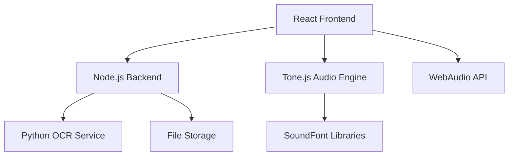
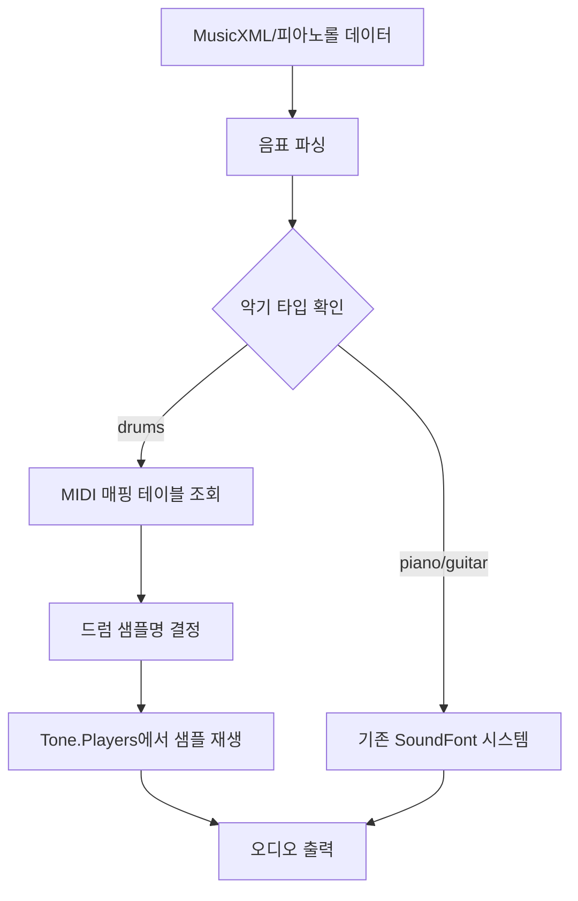

# 가상악기 (Virtual Instruments) 설계 문서

## 개요

가상악기 시스템은 PDF 악보를 업로드하여 자동으로 음표를 인식하고, 선택한 가상악기들로 자동 연주하는 웹 기반 애플리케이션입니다. 이 시스템은 클라이언트-서버 아키텍처를 기반으로 하며, 프론트엔드에서는 React와 Tone.js를, 백엔드에서는 Node.js와 Python OCR 서비스를 사용합니다.

## 아키텍처

### 전체 시스템 아키텍처



### 컴포넌트 구조

```
client/
├── src/
│   ├── pages/
│   │   └── VirtualInstruments.tsx
│   ├── components/
│   │   ├── FileUpload.tsx
│   │   ├── InstrumentSelector.tsx
│   │   ├── AudioPlayer.tsx
│   │   ├── TempoControl.tsx
│   │   └── ProgressBar.tsx
│   ├── services/
│   │   ├── ocrService.ts
│   │   ├── audioEngine.ts
│   │   └── soundFontLoader.ts
│   ├── hooks/
│   │   ├── useAudioPlayer.ts
│   │   └── useFileUpload.ts
│   └── types/
│       └── music.ts
```

## 컴포넌트 및 인터페이스

### 1. 데이터 모델

#### MusicNote 인터페이스
```typescript
interface MusicNote {
  pitch: string;        // 음 높이 (C4, D#5 등)
  duration: number;     // 음표 길이 (1=온음표, 0.5=2분음표 등)
  startTime: number;    // 시작 시간 (박자 단위)
  velocity: number;     // 음량 (0-127)
  instrument: InstrumentType;
}

interface Measure {
  number: number;
  timeSignature: string; // 4/4, 3/4 등
  notes: MusicNote[];
}

interface MusicScore {
  title?: string;
  tempo: number;        // BPM
  measures: Measure[];
  instruments: InstrumentType[];
}
```

#### 악기 타입
```typescript
enum InstrumentType {
  PIANO = 'piano',
  GUITAR = 'guitar',
  DRUMS = 'drums'
}

interface InstrumentConfig {
  type: InstrumentType;
  soundFontUrl?: string;  // 드럼의 경우 선택사항
  sampleUrls?: DrumSampleUrls;  // 드럼 전용
  midiChannel: number;
  enabled: boolean;
}

interface DrumSampleUrls {
  kick: string;
  snare: string;
  hihat_closed: string;
  hihat_open: string;
  tom: string;
  crash: string;
}

// 드럼 MIDI 매핑 테이블
interface DrumMidiMapping {
  [midiNote: number]: keyof DrumSampleUrls;
}
```

### 2. 핵심 컴포넌트

#### VirtualInstruments 메인 페이지
```typescript
interface VirtualInstrumentsProps {}

interface VirtualInstrumentsState {
  uploadedFile: File | null;
  musicScore: MusicScore | null;
  selectedInstruments: InstrumentType[];
  isPlaying: boolean;
  currentMeasure: number;
  tempo: number;
  ocrProgress: number;
  isLoading: boolean;
  error: string | null;
}
```

#### FileUpload 컴포넌트
```typescript
interface FileUploadProps {
  onFileSelect: (file: File) => void;
  onUploadProgress: (progress: number) => void;
  acceptedFormats: string[];
  maxFileSize: number;
}
```

#### InstrumentSelector 컴포넌트
```typescript
interface InstrumentSelectorProps {
  instruments: InstrumentConfig[];
  selectedInstruments: InstrumentType[];
  onInstrumentToggle: (instrument: InstrumentType) => void;
  isLoading: boolean;
}
```

#### AudioPlayer 컴포넌트
```typescript
interface AudioPlayerProps {
  musicScore: MusicScore | null;
  selectedInstruments: InstrumentType[];
  tempo: number;
  onPlayStateChange: (isPlaying: boolean) => void;
  onProgressChange: (currentMeasure: number) => void;
}
```

### 3. 서비스 레이어

#### OCR 서비스
```typescript
class OCRService {
  async uploadAndProcessPDF(file: File): Promise<MusicScore>;
  async getProcessingStatus(jobId: string): Promise<OCRStatus>;
  private convertToMusicScore(ocrResult: any): MusicScore;
}

interface OCRStatus {
  jobId: string;
  status: 'pending' | 'processing' | 'completed' | 'failed';
  progress: number;
  result?: MusicScore;
  error?: string;
}
```

#### 오디오 엔진 서비스
```typescript
class AudioEngine {
  private toneJs: typeof Tone;
  private instruments: Map<InstrumentType, Tone.Sampler>;
  private drumSampler: Tone.Players;  // 드럼 전용 샘플러
  private scheduler: Tone.Part;
  private drumMidiMap: DrumMidiMapping;
  
  async initialize(): Promise<void>;
  async loadInstrument(type: InstrumentType): Promise<void>;
  async loadDrumSamples(): Promise<void>;
  async playScore(score: MusicScore, instruments: InstrumentType[]): Promise<void>;
  private playNoteForInstrument(note: MusicNote, instrument: InstrumentType): void;
  private playDrumNote(midiNote: number, velocity: number): void;
  pause(): void;
  stop(): void;
  setTempo(bpm: number): void;
  getCurrentPosition(): number;
}
```

#### SoundFont 로더
```typescript
class SoundFontLoader {
  private cache: Map<string, ArrayBuffer>;
  
  async loadSoundFont(url: string): Promise<Tone.Sampler>;
  async preloadInstruments(instruments: InstrumentType[]): Promise<void>;
  private createSampler(soundFontData: ArrayBuffer): Tone.Sampler;
}
```

## 데이터 모델

### 음표 데이터 구조
```json
{
  "title": "Sample Music",
  "tempo": 120,
  "measures": [
    {
      "number": 1,
      "timeSignature": "4/4",
      "notes": [
        {
          "pitch": "C4",
          "duration": 0.25,
          "startTime": 0,
          "velocity": 80,
          "instrument": "piano",
          "midi": 60
        },
        {
          "pitch": "kick",
          "duration": 0.25,
          "startTime": 0,
          "velocity": 100,
          "instrument": "drums",
          "midi": 36
        }
      ]
    }
  ],
  "instruments": ["piano", "guitar", "drums"]
}
```

### 드럼 시스템 설계

#### 드럼 샘플 URL 구성
```typescript
const DRUM_SAMPLE_URLS: DrumSampleUrls = {
  kick: 'https://upload.wikimedia.org/wikipedia/commons/4/45/Kick_1.wav',
  snare: 'https://upload.wikimedia.org/wikipedia/commons/7/70/Snare_1.wav',
  hihat_closed: 'https://upload.wikimedia.org/wikipedia/commons/8/89/Closed-Hi-Hat.wav',
  hihat_open: 'https://upload.wikimedia.org/wikipedia/commons/3/3b/Open-Hi-Hat.wav',
  tom: 'https://upload.wikimedia.org/wikipedia/commons/6/6f/Tom-Drum.wav',
  crash: 'https://upload.wikimedia.org/wikipedia/commons/5/5c/Cymbal_Crash.wav'
};

const DRUM_MIDI_MAP: DrumMidiMapping = {
  36: 'kick',
  38: 'snare', 
  42: 'hihat_closed',
  46: 'hihat_open',
  45: 'tom',
  49: 'crash'
};
```

#### 드럼 재생 로직
1. **샘플 로딩**: Tone.Players를 사용하여 모든 드럼 샘플을 사전 로드
2. **MIDI 매핑**: 피아노롤 데이터의 MIDI 번호를 드럼 샘플명으로 변환
3. **재생 분기**: 악기 타입이 'drums'인 경우 drumSampler 사용
4. **오류 처리**: 샘플 로딩 실패 시 콘솔 로그 출력 후 계속 진행
5. **확장성**: URL 기반 구조로 향후 로컬 파일 교체 용이

### API 응답 구조
```json
{
  "success": true,
  "data": {
    "jobId": "uuid-string",
    "status": "completed",
    "musicScore": { /* MusicScore 객체 */ }
  },
  "error": null
}
```

## 오류 처리

### 오류 타입 정의
```typescript
enum ErrorType {
  FILE_UPLOAD_ERROR = 'FILE_UPLOAD_ERROR',
  OCR_PROCESSING_ERROR = 'OCR_PROCESSING_ERROR',
  AUDIO_LOADING_ERROR = 'AUDIO_LOADING_ERROR',
  PLAYBACK_ERROR = 'PLAYBACK_ERROR',
  NETWORK_ERROR = 'NETWORK_ERROR'
}

interface AppError {
  type: ErrorType;
  message: string;
  details?: any;
  timestamp: Date;
}
```

### 오류 처리 전략
1. **파일 업로드 오류**: 파일 형식, 크기 검증 및 사용자 가이드 제공
2. **OCR 처리 오류**: 재시도 메커니즘 및 대안 제시
3. **오디오 로딩 오류**: 브라우저 호환성 체크 및 폴백 제공
4. **네트워크 오류**: 자동 재시도 및 오프라인 모드 지원

## 테스트 전략

### 단위 테스트
- OCR 서비스 테스트
- 오디오 엔진 테스트
- 컴포넌트 렌더링 테스트

### 통합 테스트
- 파일 업로드 → OCR → 재생 플로우 테스트
- 다중 악기 동시 재생 테스트
- 템포 변경 및 재생 제어 테스트

### 성능 테스트
- 대용량 PDF 처리 성능
- 오디오 지연시간 측정
- 메모리 사용량 모니터링

## 보안 고려사항

### 파일 업로드 보안
- 파일 타입 검증 (MIME 타입 + 확장자)
- 파일 크기 제한 (최대 50MB)
- 바이러스 스캔 (선택사항)

### 데이터 보호
- 업로드된 파일의 임시 저장 및 자동 삭제
- 사용자 세션 기반 파일 접근 제어
- HTTPS 통신 강제

## 성능 최적화

### 프론트엔드 최적화
- SoundFont 파일 지연 로딩
- 오디오 버퍼 사전 로딩
- 컴포넌트 메모이제이션

### 백엔드 최적화
- OCR 처리 큐 시스템
- 결과 캐싱 (Redis)
- 파일 압축 및 CDN 활용

### 오디오 최적화
- WebAudio API 최적화
- 오디오 컨텍스트 재사용
- 샘플 레이트 최적화

## 배포 및 인프라

### 개발 환경
- React 개발 서버 (Vite)
- Node.js 백엔드 서버
- Python OCR 서비스 (Docker)

### 프로덕션 환경
- CDN을 통한 SoundFont 파일 배포
- 로드 밸런서를 통한 OCR 서비스 확장
- 모니터링 및 로깅 시스템

## 드럼 시스템 상세 설계

### 드럼 샘플러 아키텍처



### 구현 세부사항

#### 1. 드럼 샘플 로더
```typescript
class DrumSampleLoader {
  private static readonly SAMPLE_URLS: DrumSampleUrls = {
    kick: 'https://upload.wikimedia.org/wikipedia/commons/4/45/Kick_1.wav',
    snare: 'https://upload.wikimedia.org/wikipedia/commons/7/70/Snare_1.wav',
    hihat_closed: 'https://upload.wikimedia.org/wikipedia/commons/8/89/Closed-Hi-Hat.wav',
    hihat_open: 'https://upload.wikimedia.org/wikipedia/commons/3/3b/Open-Hi-Hat.wav',
    tom: 'https://upload.wikimedia.org/wikipedia/commons/6/6f/Tom-Drum.wav',
    crash: 'https://upload.wikimedia.org/wikipedia/commons/5/5c/Cymbal_Crash.wav'
  };

  static async createDrumSampler(): Promise<Tone.Players> {
    return new Tone.Players(this.SAMPLE_URLS).toDestination();
  }
}
```

#### 2. MIDI 매핑 시스템
```typescript
class DrumMidiMapper {
  private static readonly MIDI_MAP: DrumMidiMapping = {
    36: 'kick',
    38: 'snare',
    42: 'hihat_closed',
    46: 'hihat_open', 
    45: 'tom',
    49: 'crash'
  };

  static getSampleName(midiNote: number): keyof DrumSampleUrls | null {
    return this.MIDI_MAP[midiNote] || null;
  }

  static isSupportedMidiNote(midiNote: number): boolean {
    return midiNote in this.MIDI_MAP;
  }
}
```

#### 3. 통합 재생 엔진
```typescript
class AudioEngine {
  private drumSampler: Tone.Players | null = null;
  
  async initializeDrums(): Promise<void> {
    try {
      this.drumSampler = await DrumSampleLoader.createDrumSampler();
      console.log('드럼 샘플 로딩 완료');
    } catch (error) {
      console.error('드럼 샘플 로딩 실패:', error);
      this.drumSampler = null;
    }
  }

  private playNoteForInstrument(note: MusicNote, instrument: InstrumentType): void {
    if (instrument === InstrumentType.DRUMS) {
      this.playDrumNote(note);
    } else {
      this.playMelodicNote(note, instrument);
    }
  }

  private playDrumNote(note: MusicNote): void {
    if (!this.drumSampler || !note.midi) {
      console.warn('드럼 샘플러 또는 MIDI 정보 없음');
      return;
    }

    const sampleName = DrumMidiMapper.getSampleName(note.midi);
    if (!sampleName) {
      console.warn(`지원되지 않는 드럼 MIDI 노트: ${note.midi}`);
      return;
    }

    try {
      const velocity = (note.velocity || 80) / 127; // 0-1 범위로 정규화
      this.drumSampler.player(sampleName).start(undefined, 0, undefined, undefined, velocity);
    } catch (error) {
      console.error(`드럼 샘플 재생 실패 (${sampleName}):`, error);
    }
  }
}
```

### 데이터 플로우

1. **초기화 단계**
   - AudioEngine 초기화 시 initializeDrums() 호출
   - Tone.Players로 6개 드럼 샘플 사전 로딩
   - 로딩 실패 시 오류 로그 출력 후 계속 진행

2. **재생 단계**
   - 스케줄러가 각 음표의 instrument 필드 확인
   - 'drums'인 경우 playDrumNote() 호출
   - MIDI 번호를 샘플명으로 매핑
   - 해당 샘플 재생 (velocity 적용)

3. **오류 처리**
   - 샘플 로딩 실패: 경고 로그 후 해당 악기 비활성화
   - 지원되지 않는 MIDI 노트: 경고 로그 후 스킵
   - 재생 실패: 오류 로그 후 계속 진행

### 확장성 고려사항

#### 로컬 파일 지원
```typescript
// 향후 로컬 파일 지원을 위한 구조
interface DrumSampleConfig {
  useLocal: boolean;
  localPath?: string;
  remoteUrl: string;
}

const DRUM_SAMPLES: Record<keyof DrumSampleUrls, DrumSampleConfig> = {
  kick: {
    useLocal: false,
    localPath: '/assets/drums/kick.wav',
    remoteUrl: 'https://upload.wikimedia.org/wikipedia/commons/4/45/Kick_1.wav'
  }
  // ... 다른 샘플들
};
```

## 향후 확장 계획

### 단기 계획
- 추가 악기 지원 (바이올린, 첼로 등)
- MIDI 파일 내보내기 기능
- 악보 편집 기능
- 드럼 샘플 로컬 파일 지원

### 장기 계획
- AI 기반 자동 편곡 기능
- 실시간 협업 연주 기능
- 모바일 앱 개발
- 커스텀 드럼 키트 지원